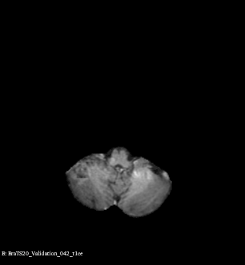

# Top 10 BraTS 2020 open sourced solution

This is the repository of our solution to the 2020 edition of the BraTS challenge. 
Our paper is available at [arXiv](https://arxiv.org/abs/2011.01045).

This repository implements Pipeline A training and inference only.
Feel free to use it as a starter for following challenge editions!

# Demo results

<div align="center">
  
</div>

<p align="center">
  <b>Example of brain tumor segmentations generated by our solution</b>
</p>

# Installation

in your favorite virtual environment:

```bash
pip install -r requirements.txt
```

# Training

First change your data source folder by modifying values in `src/config.py`

```python
BRATS_TRAIN_FOLDERS = "your-Path_to/brats2020/MICCAI_BraTS_2020_Data_Training"
BRATS_VAL_FOLDER = "your-Path_to/brats2020/MICCAI_BraTS_2020_Data_Valdation"
BRATS_TEST_FOLDER = "your-Path_to/brats2020/MICCAI_BraTS_2020_Data_Testing"
```

If you prefer not to hardcode this value, you can set them as variable environments.

Then, start training:

```
python -m src.train --devices 0 --width 48 --arch EquiUnet
```

For more details on the available option:
```
python -m src.train -h
```

Note that this code use an nn.Module to do data augmentation: any batch size above 1 could lead to errors.

After training, you will have a `runs` folder created containing a directory for each run you have done.

For each run, a yaml file with the option used for the runs, and 
a `segs` folder containing the generated .nii.gz segmentations for the validation fold used.

```
- src
    - runs
        - 20201127_34335135__fold_etc
            202020201127_34335135__fold_etc.ymal
            - segs
            model.txt # the printed model
            model_best.pth.tar # model weights
            patients_indiv_perf.csv # a log of training patient segmentation performance
            events.out.. # Tensorboard log
```

The yaml file is required to perform inference on the validation and train set

# Inference

The script to perform inference is... `inference.py` !!

```
python -m src.inference -h 
usage: inference.py [-h] [--config PATH [PATH ...]] --devices DEVICES
                    [--on {val,train,test}] [--tta] [--seed SEED]

Brats validation and testing dataset inference

optional arguments:
  -h, --help            show this help message and exit
  --config PATH [PATH ...]
                        path(s) to the trained models config yaml you want to
                        use
  --devices DEVICES     Set the CUDA_VISIBLE_DEVICES env var from this string
  --on {val,train,test}
  --tta
  --seed SEED

```

This script can take multiple models (specify multiple yaml config files), even when trained 
with different image normalization techniques (minmax or zscore);
and will automatically merge their prediction (by averaging). 
